# **Amazon S3 Security Settings and Controls**

© 2020 Amazon Web Services, Inc. and its affiliates. All rights reserved.
This sample code is made available under the MIT-0 license. See the LICENSE file.

---
## Workshop Summary

This lab is a fork of the S3 Security lab created by Mike Burbey (https://github.com/aws-samples/amazon-s3-security-settings-and-controls ).  It has been edited for time.  The student may wish to review that lab for additional security settings and controls.  

This workshop will focus on several areas of the [AWS Security Best Practices for S3](https://docs.aws.amazon.com/AmazonS3/latest/dev/security-best-practices.html), including:

1. Block Public Access
2. Require HTTPS
3. Require SSE-S3 Encryption
4. Enable Versioning
5. Using VPC endpoints and S3 Bucket policies
6. Extra Credit - Share your bucket with another AWS account

### Requirements

* AWS account - if you're doing this workshop as a part of an AWS event, you will be provided an account through a platform called Event Engine. The workshop administrator will provide instructions. If the event specifies you'll need your own account or if you're doing this workshop on your own, it's easy and free to [create an account](https://aws.amazon.com/) if you do not have one already.
* If using your own AWS account you need to setup a VPC for the rest of the lab.  [Lab0](cfn) has abbreviated instructions on how to run the CloudFormation template to add the VPC.

Familiarity with AWS, Python, CloudFormation, EC2, and Lambda is a plus but not required.

<details><summary>If you are using your own account</summary>

## Deploy AWS resources using CloudFormation

### This is out-dated and needs to be updated

1. Click one of the launch links in the table below to deploy the resources using CloudFormation.  Use a control click or right click to open in a new tab to prevent losing your Github page.

  | **Region Code** | **Region Name** | **Launch** |
  | --- | --- | --- |
  | us-west-1 | US West (N. California) | [Launch in us-west-1](https://console.aws.amazon.com/cloudformation/home?region=us-west-1#/stacks/new?stackName=S3SecurityWorkshop&amp;templateURL=https://storage-specialists-cf-templates.s3-us-west-2.amazonaws.com/2019/s3_security.json) |
  | us-west-2 | US West (Oregon) | [Launch in us-west-2](https://console.aws.amazon.com/cloudformation/home?region=us-west-2#/stacks/new?stackName=S3SecurityWorkshop&amp;templateURL=https://storage-specialists-cf-templates.s3-us-west-2.amazonaws.com/2019/s3_security.json) |
  | us-east-1 | US East (N. Virginia) | [Launch in us-east-1](https://console.aws.amazon.com/cloudformation/home?region=us-east-1#/stacks/new?stackName=S3SecurityWorkshop&amp;templateURL=https://storage-specialists-cf-templates.s3-us-west-2.amazonaws.com/2019/s3_security.json) |
  | us-east-2 | US East (Ohio) | [Launch in us-east-2](https://console.aws.amazon.com/cloudformation/home?region=us-east-2#/stacks/new?stackName=S3SecurityWorkshop&amp;templateURL=https://storage-specialists-cf-templates.s3-us-west-2.amazonaws.com/2019/s3_security.json) |
  | ca-central-1 | Canada (Central) | [Launch in ca-central-1](https://console.aws.amazon.com/cloudformation/home?region=ca-central-1#/stacks/new?stackName=S3SecurityWorkshop&amp;templateURL=https://storage-specialists-cf-templates.s3-us-west-2.amazonaws.com/2019/s3_security.json) |
  | eu-central-1 | EU (Frankfurt) | [Launch in eu-central-1](https://console.aws.amazon.com/cloudformation/home?region=eu-central-1#/stacks/new?stackName=S3SecurityWorkshop&amp;templateURL=https://storage-specialists-cf-templates.s3-us-west-2.amazonaws.com/2019/s3_security.json) |
  | eu-west-1 | EU (Ireland) | [Launch in eu-west-1](https://console.aws.amazon.com/cloudformation/home?region=eu-west-1#/stacks/new?stackName=S3SecurityWorkshop&amp;templateURL=https://storage-specialists-cf-templates.s3-us-west-2.amazonaws.com/2019/s3_security.json) |
  | eu-west-2 | EU (London) | [Launch in eu-west-2](https://console.aws.amazon.com/cloudformation/home?region=eu-west-2#/stacks/new?stackName=S3SecurityWorkshop&amp;templateURL=https://storage-specialists-cf-templates.s3-us-west-2.amazonaws.com/2019/s3_security.json) |
  | eu-west-3 | EU (Paris) | [Launch in eu-west-3](https://console.aws.amazon.com/cloudformation/home?region=eu-west-3#/stacks/new?stackName=S3SecurityWorkshop&amp;templateURL=https://storage-specialists-cf-templates.s3-us-west-2.amazonaws.com/2019/s3_security.json) |
  | eu-north-1 | EU (Stockholm) | [Launch in eu-north-1](https://console.aws.amazon.com/cloudformation/home?region=eu-north-1#/stacks/new?stackName=S3SecurityWorkshop&amp;templateURL=https://storage-specialists-cf-templates.s3-us-west-2.amazonaws.com/2019/s3_security.json) |
  | ap-east-1 | Asia Pacific (Hong Kong) | [Launch in ap-east-1](https://console.aws.amazon.com/cloudformation/home?region=ap-east-1#/stacks/new?stackName=S3SecurityWorkshop&amp;templateURL=https://storage-specialists-cf-templates.s3-us-west-2.amazonaws.com/2019/s3_security.json) |
  | ap-northeast-1 | Asia Pacific (Tokyo) | [Launch in ap-northeast-1](https://console.aws.amazon.com/cloudformation/home?region=ap-northeast-1#/stacks/new?stackName=S3SecurityWorkshop&amp;templateURL=https://storage-specialists-cf-templates.s3-us-west-2.amazonaws.com/2019/s3_security.json) |
  | ap-northeast-2 | Asia Pacific (Seoul) | [Launch in ap-northeast-2](https://console.aws.amazon.com/cloudformation/home?region=ap-northeast-2#/stacks/new?stackName=S3SecurityWorkshop&amp;templateURL=https://storage-specialists-cf-templates.s3-us-west-2.amazonaws.com/2019/s3_security.json) |
  | ap-northeast-3 | Asia Pacific (Osaka-Local) | [Launch in ap-northeast-3](https://console.aws.amazon.com/cloudformation/home?region=ap-northeast-3#/stacks/new?stackName=S3SecurityWorkshop&amp;templateURL=https://storage-specialists-cf-templates.s3-us-west-2.amazonaws.com/2019/s3_security.json) |
  | ap-southeast-1 | Asia Pacific (Singapore) | [Launch in ap-southeast-1](https://console.aws.amazon.com/cloudformation/home?region=ap-southeast-1#/stacks/new?stackName=S3SecurityWorkshop&amp;templateURL=https://storage-specialists-cf-templates.s3-us-west-2.amazonaws.com/2019/s3_security.json) |
  | ap-southeast-2 | Asia Pacific (Sydney) | [Launch in ap-southeast-2](https://console.aws.amazon.com/cloudformation/home?region=ap-southeast-2#/stacks/new?stackName=S3SecurityWorkshop&amp;templateURL=https://storage-specialists-cf-templates.s3-us-west-2.amazonaws.com/2019/s3_security.json) |
  | ap-south-1 | Asia Pacific (Mumbai) | [Launch in ap-south-1](https://console.aws.amazon.com/cloudformation/home?region=ap-south-1#/stacks/new?stackName=S3SecurityWorkshop&amp;templateURL=https://storage-specialists-cf-templates.s3-us-west-2.amazonaws.com/2019/s3_security.json) |
  | me-south-1 | Middle East (Bahrain) | [Launch in me-south-1](https://console.aws.amazon.com/cloudformation/home?region=me-south-1#/stacks/new?stackName=S3SecurityWorkshop&amp;templateURL=https://storage-specialists-cf-templates.s3-us-west-2.amazonaws.com/2019/s3_security.json) |
  | sa-east-1 | South America (São Paulo) | [Launch in sa-east-1](https://console.aws.amazon.com/cloudformation/home?region=sa-east-1#/stacks/new?stackName=S3SecurityWorkshop&amp;templateURL=https://storage-specialists-cf-templates.s3-us-west-2.amazonaws.com/2019/s3_security.json) |

2. Click  **Next**  on the Create Stack page.
3. Click  **Next**.
4. Click  **Next**  Again. (skipping the Options and Advanced options sections)
5. On the Review page, scroll to the bottom and check the boxes to acknowledge that CloudFormation will create IAM resources, then click  **Create stack**.  

  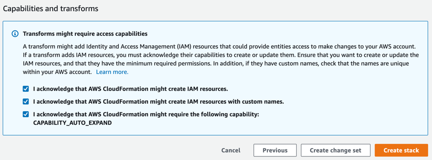
6. Click **Events**. Events will not auto refresh.  You will need to manually refresh the page using the refresh button on the right side of the page.
7. Watch for **S3SecurityWorkshop** and a status of **CREATE_COMPLETE**

  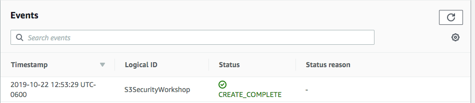
8. Click **Output**.  
9. Copy and paste the name of Bucket01 into a document on your computer.  

**Note:** Instances that are launched as part of this CloudFormation template may be in the initializing state for few minutes.

## Connect to the EC2 Instance using EC2 Instance Connect

1. From the AWS console, click  **Services**  and select  **EC2.**
2. Select  **Instances**  from the menu on the left.
3. Wait until the state of the S3_Workshop_Instance01 instance  shows as _running_ and all Status Checks have completed (i.e. **not** in _Initializing_ state).
4. Right-click on the **S3_Workshop_Instance01** instance and select  **Connect** from the menu.
5. From the dialog box, select the EC2 Instance Connect option, as shown below:

  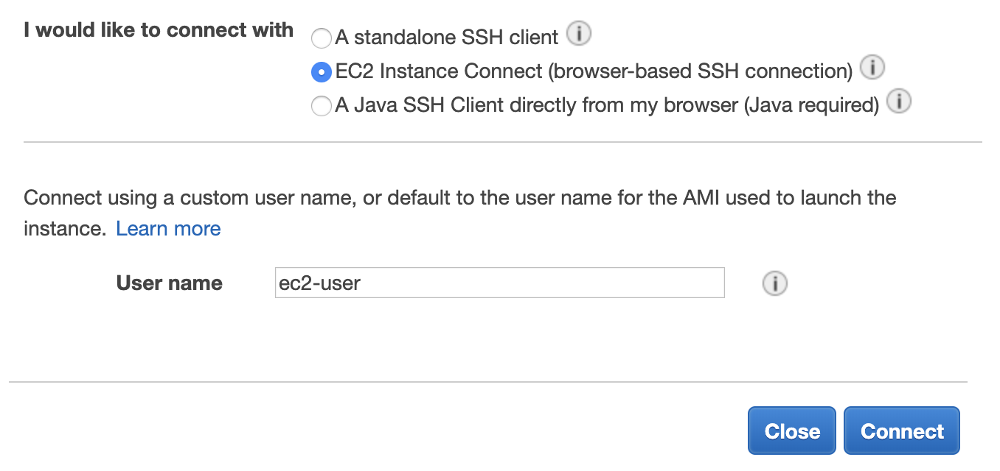

6. For the **User name** field, enter "ec2-user", then click **Connect**.

A new dialog box or tab on your browser should appear, providing you with a command line interface (CLI).  Keep this open - you will use the command line on the instance throughout this workshop.

**Note:**  The SSH session will disconnect after a period of inactivity.  If your session becomes unresponsive, close the window and repeat the steps above to reconnect.


## Setup AWS CLI

1. In the CLI for the instance, run the following commands to setup the AWS CLI
    ```
    aws configure
    ```
    Leave Access Key and Secret Key blank, set the region to the region you deployed your CloudFormation template in , output format leave default.

  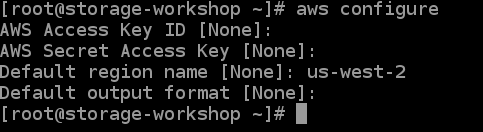  

2. Create a credentials file to be used by the AWS CLI.  This will allow you to switch between two different users easily.  
    ```
    cd ~/.aws  
    vi credentials  
    ```
Copy and paste the following credentials file template into your vi session.
```
[user1]
aws_access_key_id =
aws_secret_access_key =
[user2]
aws_access_key_id =
aws_secret_access_key =
```    
3. From the AWS console, click  **Services**  and select  **IAM.**  
4. Click **Users** in the left pane.  
5. Click **s3_security_lab_user1**.  
6. Click **Security credentials** tab.  
7. Click **Create access key**.  
8. Copy the Access key ID and Secret access key into the credentials file under User1.
9. Click **Close**.
10. Click **Users** in the left pane.
11. Click **s3_security_lab_user2**.
12. Click **Create access key**.  
13. Copy the Access key ID and Secret access key into the credentials file under User2.
14. Compare you credentials file to the one below and ensure your formatting is the same.  

  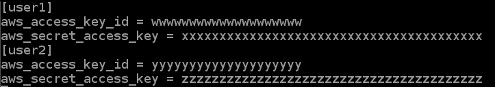  

15. Save the file

</details>

<details><summary>If you are running this lab at an AWS Event</summary>


If you are running this at an AWS event, the CloudFormation script has already been executed for you.  You have a terminal session, provided by AWS Cloud9.

At the event, you will be provided a 12-digit hash which provides temporary access to an AWS account.


## 1. Getting started with _Event Engine_

In this first lab, we will create parameters.

Start by logging into to [Event Engine](https://dashboard.eventengine.run/login).

Enter your 12-digit hash and Accept.


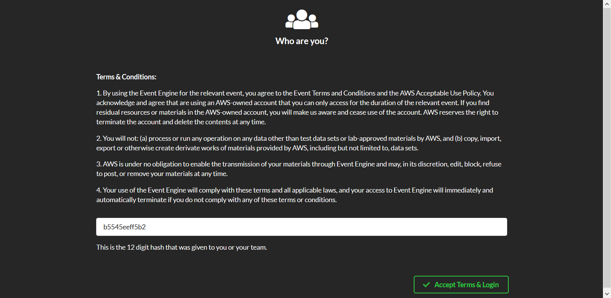.


Select AWS Console. 

<div align="center">

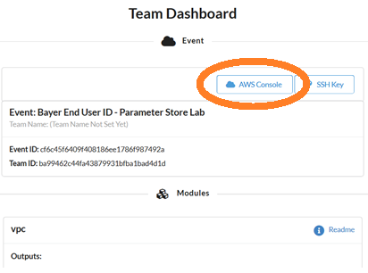
</div>

And again on the Team Dashboard, select Console 
<div align="center">

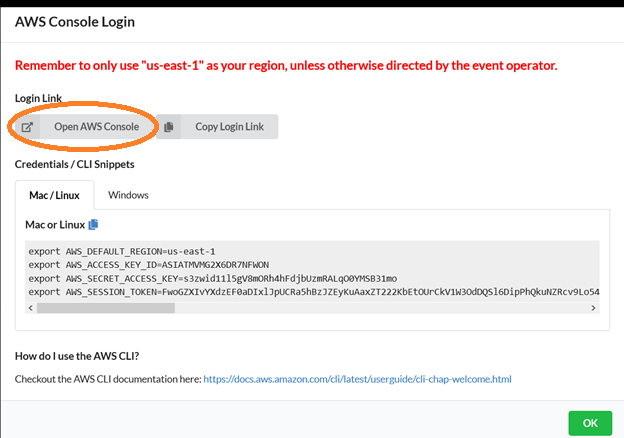

</div>

From the AWS console, navigate to [Cloud9](https://console.aws.amazon.com/cloud9/home?region=us-east-1) and "Open IDE"
<div align="center">

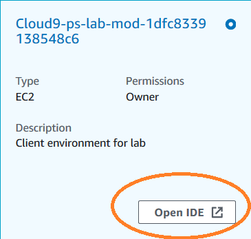
</div>

</details>

### IMPORTANT: Workshop Cleanup

If you're attending an AWS event and are provided an account to use, you can ignore this section because we'll destroy the account once the workshop concludes. 

**If you are using your own account**, it is **VERY** important you clean up resources created during the workshop. Follow these steps once you're done going through the workshop to delete resources that were created:

1. Navigate to the [CloudFormation dashboard](https://console.aws.amazon.com/cloudformation/home#/stacks) in the primary region and click on your workshop stack name to load stack details.
2. Click **Delete** to delete the stack.

## Exercise #1 - Block Public Access

By default, AWS buckets are not publically accessible.  You do not need to make them publically available to share with another account, role, or user.  We will explore one method of granting read-only access to another account later in this lab.

There are legitimate reasons to enable public access, such as using S3 to host web content or to share public-domain data.  The general rule, don't make the bucket public without purpose.

Should you make a bucket public, you'll see this console icon.
<div align="center">


</div>

For this lab we will **not** be adding any public S3 access.  We will set a policy to disable public access for the account-wide.

Navigate to the [S3 Console](https://console.aws.amazon.com/s3/home?region=us-east-1#).

On the left-side panel, there is a selection "Block public access (account settings)"

<div align="center">

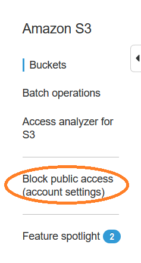
</div>

Click here, to set the account-wide defaults.

<div align="center">

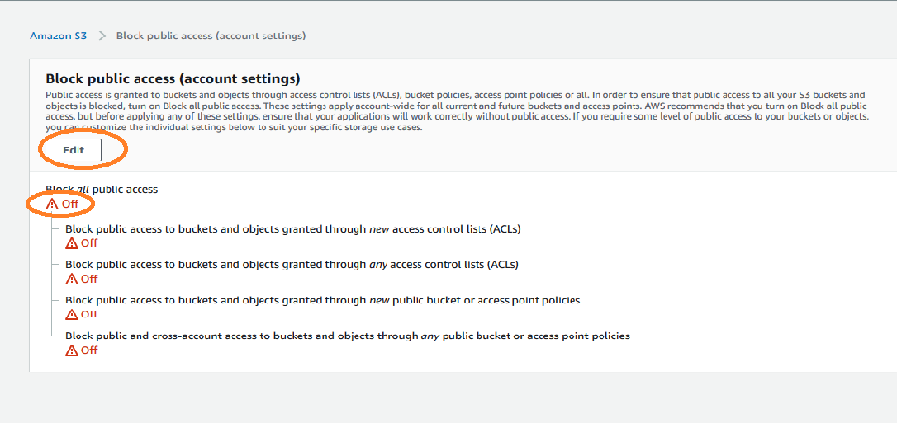
</div>

Click Edit, then select the check mark, Block _all_ public access.

A word of explanation on these choices. There are two ways to control access, ACLs and bucket policies. For each of these access methods, you can chose whether to enforce rules for existing or future buckets.

In the event you **Need** a public bucket, of course you wouldn't block the whole account.  In that event, you will see a very similar screen from the permissions tab for that bucket.

You have successfuly set the account to not allow public S3 access.  Please proceed to exercise 2.

## Exercise #2- Require HTTPS

In this exercise we will create a S3 Bucket Policy that requires connections to be secure.

1. From the AWS console, click  **Services**  and select  **S3.**
2. Click the bucket name. (Copied from CloudFormation Outputs previously.)
3. Click on the **Permissions** tab.  
4. Click **Bucket Policy**.  
5. Copy the bucket policy below and paste into the Bucket Policy Editor.
```json
{
"Statement": [
{
   "Action": "s3:*",
   "Effect": "Deny",
   "Principal": "*",
   "Resource": "arn:aws:s3:::BUCKET_NAME/*",
   "Condition": {
       "Bool": {
        "aws:SecureTransport": false
        }
    }
    }
  ]
}
```

6. Replace BUCKET_NAME with the bucket name.  Sample bucket policy below.

  

7. Click **Save**
8. In your SSH session run the following command. The command should return a 403 error since the endpoint-url is HTTP.

```bash
    aws s3api head-object --key app1/file1 --endpoint-url ht<span>tp//s3.amazonaws.com --profile user1 --bucket ${bucket}
```

9. In your SSH session run the following command. This command should succeed since it is using HTTPS.

```bash
    aws s3api --endpoint-url ht<span>tps://s3.amazonaws.com --profile user1 head-object --key app1/file1 --bucket ${bucket}
```

You have successfuly set the bucket policy to require HTTPS.  Please proceed to Exercise 3.

## Exercise #3- Require SSE-S3 Encryption

In this exercise we will create a S3 Bucket Policy that requires data at rest encryption.  We will also look at Default Encryption.

1. From the AWS console, click  **Services**  and select  **S3.**
2. Click the bucket name. (Copied from CloudFormation Outputs previously.)
3. Click on the **Permissions** tab.  
4. Click **Bucket Policy**.  
5. Click **Delete**, click **Delete** to confirm.  
6. Copy the bucket policy below and paste into the Bucket Policy Editor.

```json
{
    "Statement": [
        {
            "Effect": "Deny",
            "Principal": "*",
            "Action": "s3:PutObject",
            "Resource": "arn:aws:s3:::BUCKET_NAME/*",
            "Condition": {
                "StringNotEquals": {
                    "s3:x-amz-server-side-encryption": "AES256"
                }
            }
        }
    ]
}
```

<details>
<summary>What if you want both HTTP and Encryption?</summary>

A bucket can only have a single policy.  As such, by pasting in the policy above, you are removing the policy to require HTTPS which we created in the prior exercise.  That is why the policy is a JSON array.  To have both HTTPS and require server-side encryption, you add both statements, similar to:

```json

{
"Statement": [
{
   "Action": "s3:*",
   "Effect": "Deny",
   "Principal": "*",
   "Resource": "arn:aws:s3:::BUCKET_NAME/*",
   "Condition": {
       "Bool": {
        "aws:SecureTransport": false
        }
    }
    },
    {
            "Effect": "Deny",
            "Principal": "*",
            "Action": "s3:PutObject",
            "Resource": "arn:aws:s3:::BUCKET_NAME/*",
            "Condition": {
                "StringNotEquals": {
                    "s3:x-amz-server-side-encryption": "AES256"
                }
            }
        }
  ]
}

```

</details>


1. Replace BUCKET_NAME with the bucket name.  Sample bucket policy below.  

     
8. Click **Save**  
9. Go to your SSH session and create a small text file using the following command.
   ```
   cd ~  
   echo "123456789abcdefg" > textfile  
   ```
10. Attempt to PUT an object without encryption. The request should fail.
  ```
  aws s3api put-object --key text01 --body textfile --profile user1 --bucket ${bucket}
  ```
11. PUT an object using SSE-S3.  The request should succeed.
  ```
  aws s3api put-object --key text01 --body textfile --server-side-encryption AES256 --profile user1 --bucket ${bucket}  
  ```
12. From the AWS console, click  **Services**  and select  **S3.**  
13. Click the bucket name. (Copied from CloudFormation Outputs previously.)  
14. Click on the **Properties** tab.    
15. Default Encryption for AES-256(SSE-S3) is enabled.  

**Note**  
Bucket Policies are enforced based on the request from the client.  In this case the Bucket Policy denied the first attempt to PUT an object. Since Default Encryption is enabled the first attempt would have ended up encrypted anyway, however, Default Encryption doesn't override encryption flags.  For example, if Default Encryption is set to AWS-KMS and a request is sent with AES-256(SSE-S3) the request will be written as AES-256(SSE-S3).  Default Encryption behaves like a default not an override.  If a customer has a requirement that all objects have a certain type of encryption, then the only way to meet that requirement is with a bucket policy.

## Exercise #4 - Enable Versioning

S3 is designed to provide 99.999999999% durability of objects over a given year. For example, if you store 10,000,000 objects with Amazon S3, you can on average expect to incur a loss of a single object once every 10,000 years. In addition, Amazon S3 Standard, S3 Standard-IA, and S3 Glacier are all designed to sustain data in the event of an entire S3 Availability Zone loss.

From a data protection perspective, the biggest threat to your data is an application bug or human error.  One way to protect against this is to enable versioning.

Versioning allows you to preserve, retrieve, and restore every version of every object stored in an Amazon S3 bucket. Once you enable Versioning for a bucket, Amazon S3 preserves existing objects anytime you perform a PUT, POST, COPY, or DELETE operation on them. By default, GET requests will retrieve the most recently written version. Older versions of an overwritten or deleted object can be retrieved by specifying a version in the request.

Since versioning potentially keeps multiple copies of your object, incremental storage prices apply.  You can use [ Lifecycle rules ](https://docs.aws.amazon.com/AmazonS3/latest/user-guide/create-lifecycle.html) along with Versioning to implement a rollback window for your Amazon S3 objects.

In this lab, you will enable versioning of a bucket, then delete an object.  Finally, you will _undelete_ the object.

1. Navigate to the [S3 Console](https://console.aws.amazon.com/s3/home?region=us-east-1)
2. Click on your bucket, then select Properties.


<div align="center">

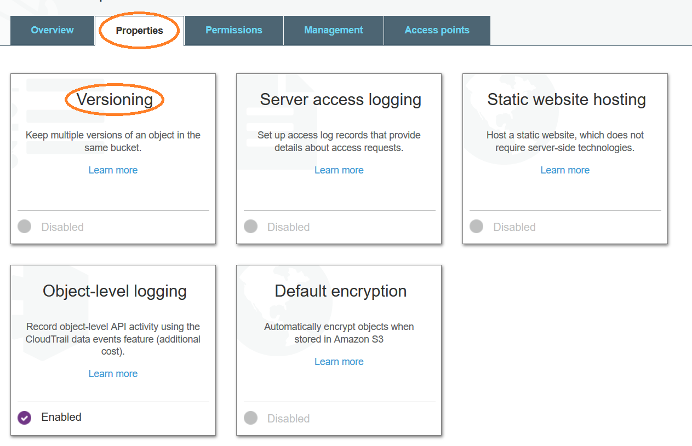
</div>

3. Select the Versioning button, and enable Versioning.

<div align="center">

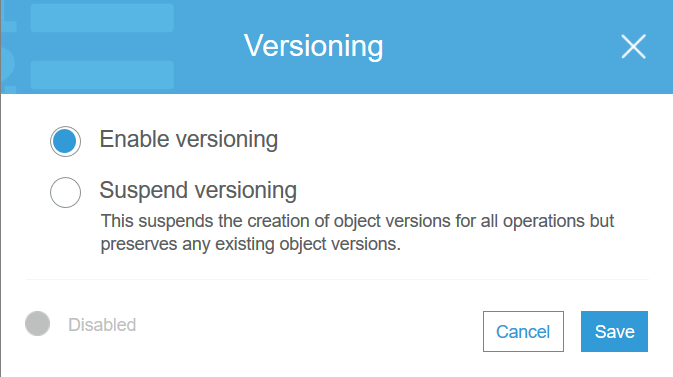
</div>

4. In the terminal window, create a temporary file, and over-write one of the existing files in the bucket.

```bash
bucket=YOUR_BUCKET_NAME_HERE
dd if=/dev/zero of=/tmp/tmpfile bs=1024 count=5
aws s3 cp /tmp/tmpfile s3://$bucket/app1/file1
```

5. Go back to the S3 console to explore the result.  Navigate to /app1 in your bucket, and click the button "Verions Show".  

You now have the old version and the new version of the **_/app1/file1_** object.

<div align="center">

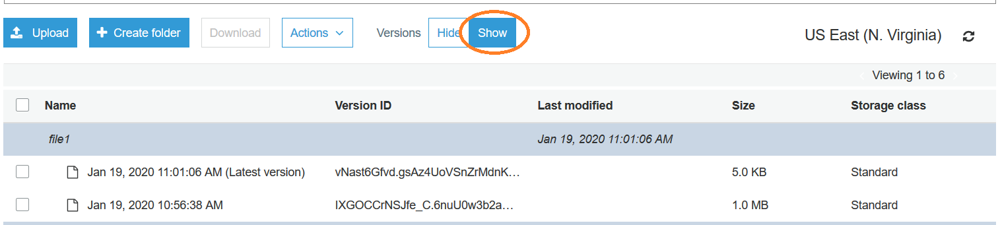
</div>

6. In the terminal, delete the file.

```bash
bucket=YOUR_BUCKET_NAME_HERE
aws s3 rm s3://$bucket/app1/file1
```

In the console you will see that the file was deleted, by placing a _Delete marker_ above it.  Toggle the Versions Hide/Show button to see the impact.

<div align="center">


</div>

7. Undelete the file, by deleting the _Delete marker_.  Select the Delete marker, Actions -> Delete.

Versioning comes in handy if you accidentally delete an object.  For more robust data protection, it is often combined with [MFA delete](https://docs.aws.amazon.com/AmazonS3/latest/dev/UsingMFADelete.html) requirements or  [replicating](https://docs.aws.amazon.com/AmazonS3/latest/dev/replication.html) the object to another bucket in a second account.

Note - Versioning can not be disabled, but it can be suspended.  You suspend versioning to stop accruing new versions of the same object in a bucket. You might do this because you only want a single version of an object in a bucket, or you might not want to accrue charges for multiple versions.

## Exercise #5- Restrict Access to a  S3 VPC Endpoint

In this exercise we will configure a S3 VPC Endpoint and a bucket policy to limit access to only requests that pass through the VPC Endpoint.  This is an easy way to limit access to only clients in your VPC.

1. In the AWS Console go to **VPC**.  
2. Click **Endpoints**.  
3. Click **Create Endpoint**.
4. Select the **S3** service name.

5. Select the **S3SecurityWorkshopVPC** from the drop down menu.

6. Do not select any route tables for now.  

7. Leave Policy set to **Full Access**

8. Click **Create endpoint**.
9. Click **Close**
10. Record the **Endpoint ID**.  

12. From the AWS console, click  **Services**  and select  **S3.**
13. Click the bucket name. (Copied from CloudFormation Outputs previously.)
14. Click on the **Permissions** tab.  
14. Click **Bucket Policy**.  
15. Copy the bucket policy below and paste into the Bucket Policy Editor.

```json
{
    "Statement": [
        {
            "Action": "s3:*",
            "Effect": "Deny",
            "Resource": "arn:aws:s3:::BUCKET_NAME/*",
            "Condition": {
                "StringNotEquals": {
                    "aws:sourceVpce": "VPC_ENDPOINT_ID"
                }
            },
            "Principal": "*"
        }
    ]
}
```

16. Replace BUCKET_NAME with the bucket name and VPC_ENDPOINT_ID with the Endpoint ID.  Sample bucket policy below.  

17. Click **Save**
18. Go to your SSH session, the request will fail since the S3 VPCE isn't associated with a route table.  
  
  ```bash
  aws s3api head-object --key app1/file1 --profile user1 --bucket ${bucket}
  ```

19. In the AWS Console go to **VPC**.  
20. Click **Endpoints**.  
21. The VPC Endpoint should be selected.  Select **Actions**, then click **Manage Route Tables**.
22. Select the Route Table that is associated with **S3SecurityWorkshopSubnet**

23. Click **Modify Route Tables**.  
    This will cause the hosts inside your VPC to route through the VPC gateway endpoint, inside your VPC to access S3.  The request will **not** have to travel across public Internet address space.
24. Go to your SSH session, run the following command. The request should now succeed.  
  
```bash
  aws s3api head-object --key app1/file1 --profile user1 --bucket ${bucket}
```

25. From the AWS console, click  **Services**  and select  **S3.**
26. Click the bucket name. (Copied from CloudFormation Outputs previously.)
27. Click on the **Permissions** tab.  
28. Click **Bucket Policy**.
29. Click **Delete**, click **Delete** to confirm.

## Lab 6 - Extra Credit - Share your bucket with another AWS account

There are times, when you may want to share specific data with another AWS account.  While this might be accomplished with an access control list, it is recommended to use bucket policies. [ ACLs, an older feature of S3, are still supported but no longer recommended ].

For this lab, you will need a partner, with a second AWS account.  You will create a bucket, add some content, and share that bucket with your partner.

1. Create a bucket, and add a file to the bucket.  From the CLI, type

```bash
 bucket=NEW_BUCKET_NAME_HERE
 aws s3 mb s3://$bucket
 dd if=/dev/zero of=/tmp/foo bs=1024 count=1024
 aws s3 cp /tmp/foo s3://$bucket/shared-data/foo
```

2. Verify the bucket contents

```bash
 aws s3 ls s3://$bucket --recursive
```

3. Select a partner, and get their account number.

For this lab, select a partner.  Use their account number, and share only the /shared-data prefix with that partner.  You will need to know their account number.  One way to learn this is from the console.  If you click right, on the login at the top right of the console, your account number will be included in that information.  The console generates account numbers with “-“ for readability; the actual account number doesn’t include these “-“ symbols.

An alternate method is through the CLI.  Ask you partner to run the command

```bash
 aws sts get-caller-identity
```

Make a note of their account number, you will need it to generate the bucket policy.

Navigate to your bucket in the S3 console. ( https://console.aws.amazon.com/s3/home?region=us-east-1 ).  Click on your bucket to open it, and select the Permissions tab.

<div align="center">

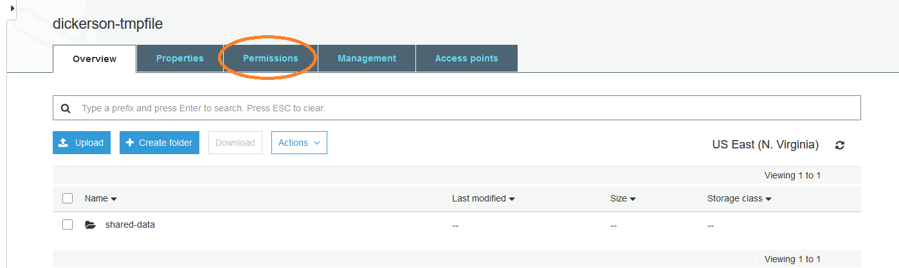
</div>


Select **Bucket Policy**

<div align="center">

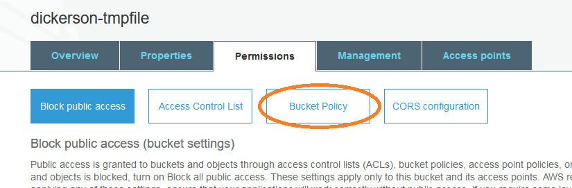
</div>

Near the bottom of the screen, select “**Policy generator**”
We need to create two elements of the policy.  We’d like the other account to be able to GetObjects and ListObjects.

_Create GetObject Element of policy_
**Type of Policy:** S3 Bucket Policy
**Principal:** The account number you are sharing with
**Actions:** 
GetObject
**Amazon Resource Name:** _( note, edit this for the bucket you created ).  Be sure to include the “*” at the end._

arn:aws:s3:::YOUR-BUCKET-NAME/share/*

This ARN matches all objects in the prefix “share” in bucket “YOUR-BUCKET-NAME”.  

Click Add Statement to add permissions to list objects.

_Create ListBucket Element of policy_
**Type of Policy:** S3 Bucket Policy
**Principal:** The account number you are sharing with
**Actions:** 
ListBucket
**Amazon Resource Name:** _( note, edit this for the bucket you created. )
_  
arn:aws:s3:::YOUR-BUCKET-NAME

When you’ve entered the data for your policy, click Add Statement, and Generate Policy.

Copy the resulting policy JSON to a text file.  It should look something like:

```json
{
  "Id": "Policy1579374599915",
  "Version": "2012-10-17",
  "Statement": [
    {
      "Sid": "Stmt1579374406593",
      "Action": [ 
        "s3:GetObject"
      ],
      "Effect": "Allow",
      "Resource": "arn:aws:s3:::YOUR-BUCKET-NAME/share/*",
      "Principal": {
        "AWS": [
          "1234567890AB"
        ]
      }
    },
    {
      "Sid": "Stmt1579374574931",
      "Action": [
        "s3:ListBucket"
      ],
      "Effect": "Allow",
      "Resource": "arn:aws:s3:::YOUR-BUCKET-NAME/share",
      "Principal": {
        "AWS": [
          "1234567890AB"
        ]
      }
    }
  ]
}
```

Return to the prior S3 tab, where you were editing the bucket policy, and paste in the new policy, then click save.

3. Go to your partners account and verify that you can access the bucket.

```bash
 bucket=YOUR_BUCKET_NAME
 # List the other account's bucket
 aws s3 ls s3://$bucket
 # Pull the object (GetObject) from the other account's bucket
 aws s3 cp s3://$bucket/shared-data/foo /tmp/myfile
 ls -l /tmp/myfile
```

It is also possible to share just the contents of a single prefix with another account, using a Condition statement.  See this [blog post](https://aws.amazon.com/blogs/security/writing-iam-policies-grant-access-to-user-specific-folders-in-an-amazon-s3-bucket/) for more information on sharing just one folder.

## Clean Up Resources

To ensurer you don't continue to be billed for services in your account from this workshop follow the steps below to remove all resources created ruing the workshop.

1. In your SSH session run the following command.  
  
  ```bash
  aws s3 rm s3://${bucket} --recursive  --profile user1
  ```

2. From the AWS console, click  **Services**  and select  **Config.**  
2. Click **Rules**.  
3. Click **s3_bucket_public_write_prohibited**.
4. Click **Edit**.
5. Click **Delete Rule**.(Must scroll down)
6. Click **Delete**
7. In the AWS Console go to **VPC**.  
8. Click **Endpoints**.
9. Select the Endpoint created earlier, select **Actions**, click **Delete Endpoint**.  
10. Click **Yes,Delete**.
11. From the AWS console, click  **Services**  and select  **CloudFormation.**  
12. Select **S3SecurityWorkshop**.  
13. Click **Delete**.  
14. Click **Delete stack**.  
15. It will take a few minutes to delete everything.  Refresh the page to see an updated status.  **S3SecurityWorkshop** will be removed from the list if everything has been deleted correctly.
